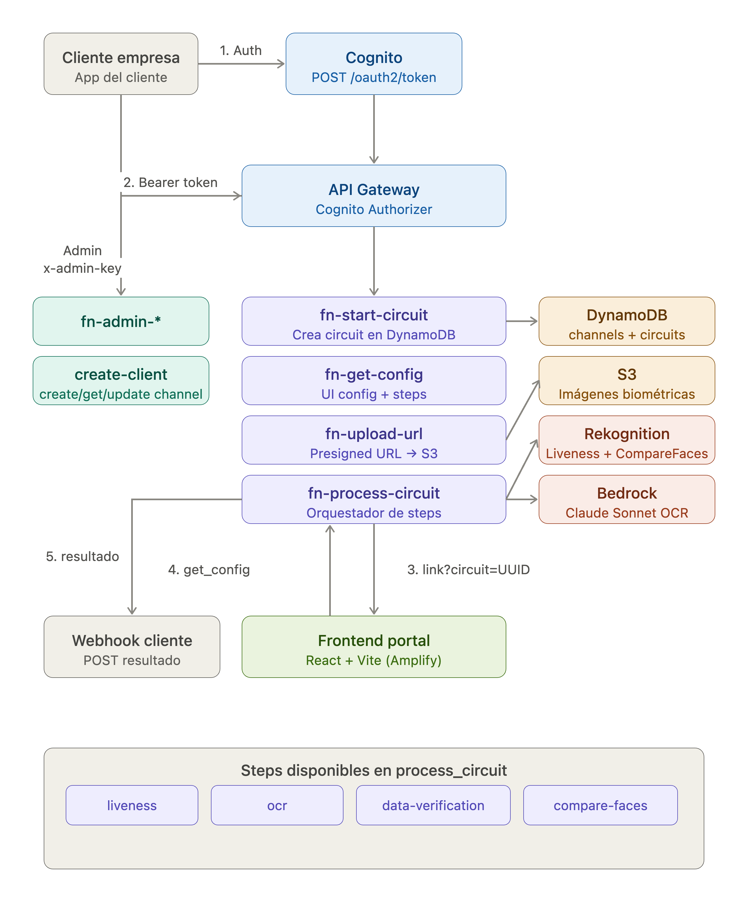

# biometric-api

SDK biométrico como servicio (SaaS) que permite a cualquier empresa integrar verificaciones de identidad en sus aplicaciones mediante una API REST moderna.

## Arquitectura

- **AWS Amplify Gen 2** - Infraestructura como código con TypeScript
- **API Gateway** - Endpoints REST con Cognito Authorizer
- **DynamoDB** - Tablas `channels` y `circuits`
- **S3** - Bucket para documentos biométricos
- **AWS Rekognition** - Liveness detection y face comparison
- **AWS Bedrock** - Claude Sonnet 4.5 para OCR y verificación de datos

## Instalación

### Prerrequisitos

- Cuenta de AWS con permisos para Amplify, API Gateway, DynamoDB, S3, Rekognition y Bedrock
- GitHub account con fork del repositorio

### Pasos de instalación

1. **Fork del repositorio**

   Hacer fork de este repositorio en GitHub y clonar localmente:

   ```bash
   git clone https://github.com/TU_USUARIO/biometric-api.git
   cd biometric-api
   ```

2. **Crear app en Amplify**

   - Ir a AWS Amplify Console
   - Click en "New app" → "Build any app"
   - Conectar el repositorio forkado
   - Seleccionar la rama `main`

3. **Generar ADMIN_KEY**

   ```bash
   openssl rand -base64 32
   ```

   Este comando genera una clave secreta aleatoria de 32 bytes codificada en Base64.

4. **Configurar variables de entorno**

   En la consola de Amplify, ir a:
   - **Environment variables** → **Edit**

   Agregar las siguientes variables:

   | Variable | Valor |
   |----------|-------|
   | `ADMIN_KEY` | Valor generado con `openssl rand -base64 32` |
   | `USER_POOL_ID` | Se configura automáticamente en el primer deploy |

5. **Deploy**

   - Amplify iniciará el deployment automáticamente
   - Primera vez: crea todos los recursos de infraestructura
   - En `addOutput` estarán disponibles: `userPoolId`, `apiGatewayUrl`, etc.

6. **Configurar USER_POOL_ID**

   Después del primer deploy exitoso:
   - Ir a Amplify Console → Backend environments
   - Copiar `USER_POOL_ID` del output
   - Agregar como variable de entorno en Amplify Console

   > **Importante**: USER_POOL_ID es necesario para que `fn-admin-create-client` pueda crear App Clients.

## Variables de entorno

| Variable | Descripción | Cómo obtenerla |
|----------|-------------|----------------|
| `ADMIN_KEY` | Clave secreta para endpoints admin | `openssl rand -base64 32` |
| `USER_POOL_ID` | ID del Cognito User Pool | Amplify Console → Backend environments → addOutput |
| `AWS_BRANCH` | Rama de ambiente (dev/staging/prod) | Opcional, default: `dev` |

## Endpoints API Admin (x-admin-key)

Estos endpoints son usados por el equipo de soporte mediante Postman para configurar clientes y canales.

### POST /api/admin/clients/create

Crea un App Client de Cognito para un cliente empresarial.

**Headers:**
```
x-admin-key: <ADMIN_KEY>
Content-Type: application/json
```

**Body:**
```json
{
  "code_client": "cliente001",
  "username": "admin@cliente.com"
}
```

**Response (201):**
```json
{
  "clientId": "abc123...",
  "clientSecret": "xyz789..."
}
```

> **Importante**: El `clientSecret` solo se muestra una vez. Guardarlo de forma segura.

### POST /api/admin/channels

Crea un canal de verificación biométrica con su configuración.

**Headers:**
```
x-admin-key: <ADMIN_KEY>
Content-Type: application/json
```

**Body:**
```json
{
  "id_client": 123,
  "code_client": "cliente001",
  "username": "admin@cliente.com",
  "name": "Verificación de identidad",
  "channel_type": "biometric",
  "settings": {
    "steps": ["liveness", "ocr", "data-verification", "compare-faces"],
    "baseUrl": "https://verificacion.cliente.com",
    "webhookUrl": "https://api.cliente.com/callback/biometric",
    "projectId": "201208",
    "ui": {
      "headerTitle": "Verificación de identidad",
      "bgColor": "#FCFCFC",
      "colors": {
        "primary": "#0a1a3c",
        "background": "#eff3f9"
      },
      "layout": { "headerAlign": "center" }
    },
    "thresholds": {
      "livenessConfidenceThreshold": 80,
      "compareFacesSimilarityThreshold": 80
    }
  }
}
```

**Response (201):**
```json
{
  "channelId": "uuid-del-canal",
  "createdAt": "2025-08-20T10:00:00.000Z"
}
```

### GET /api/admin/channels/{id}

Obtiene la configuración completa de un canal.

### PUT /api/admin/channels/{id}

Actualiza la configuración de un canal. Soporta actualización parcial (deep merge).

## Endpoints API Pública (Bearer token)

Estos endpoints son usados por las aplicaciones cliente para integrar verificación biométrica.

### POST /oauth2/token

Obtiene un access token de Cognito mediante el flujo Client Credentials.

**Body (x-www-form-urlencoded):**
```
grant_type=client_credentials
&client_id=<CLIENT_ID>
&client_secret=<CLIENT_SECRET>
&scope=biometric-danaconnect/access
```

**Response:**
```json
{
  "access_token": "eyJraWQi...",
  "token_type": "Bearer",
  "expires_in": 3600
}
```

### POST /api/biometric/start_circuit/{channel_id}

Inicia un nuevo circuito de verificación biométrica.

**Headers:**
```
Authorization: Bearer <ACCESS_TOKEN>
Content-Type: application/json
```

**Body:**
```json
{
  "person": {
    "name": "Juan Pérez",
    "documentNumber": "12345678",
    "email": "juan@email.com"
  }
}
```

**Response (201):**
```json
{
  "circuitId": "uuid-del-circuito",
  "link": "https://verificacion.cliente.com/?circuit=uuid-del-circuito"
}
```

### GET /api/biometric/get_config/{circuit_id}

Obtiene la configuración de UI y thresholds para renderizar el flujo de verificación.

**Response:**
```json
{
  "circuitId": "uuid",
  "status": "pending",
  "currentStep": null,
  "stepsCompleted": [],
  "steps": ["liveness", "ocr", "data-verification", "compare-faces"],
  "channelType": "biometric",
  "ui": {
    "headerTitle": "Verificación de identidad",
    "headerLogoUrl": "https://...",
    "bgColor": "#FCFCFC",
    "footerPrivacyPolicyUrl": "https://...",
    "footerWebsiteUrl": "https://...",
    "colors": { "primary": "#0a1a3c", ... },
    "layout": { "headerAlign": "center" }
  },
  "thresholds": {
    "livenessConfidenceThreshold": 80,
    "compareFacesSimilarityThreshold": 80,
    "ocrConfidenceThreshold": 70,
    "maxAttempts": 3,
    "requiresBackDocument": false
  }
}
```

### GET /api/biometric/upload-url/{circuit_id}?type=front|back

Genera una presigned URL para subir imágenes de documentos a S3.

**Response:**
```json
{
  "uploadUrl": "https://biometric-api-dev-documents.s3.../cliente001/uuid/front.jpg?...",
  "s3Key": "cliente001/uuid/front.jpg",
  "expiresIn": 600
}
```

**Subir imagen con curl:**
```bash
curl -X PUT -H "Content-Type: image/jpeg" \
  --data-binary @front.jpg \
  "https://...presigned-url..."
```

### POST /api/biometric/process_circuit/{circuit_id}

Ejecuta un paso de verificación biométrica.

**Headers:**
```
Authorization: Bearer <ACCESS_TOKEN>
Content-Type: application/json
```

**Body para liveness:**
```json
{
  "step": "liveness",
  "data": { "sessionId": "rekognition-session-id" }
}
```

**Body para OCR:**
```json
{
  "step": "ocr"
}
```

**Body para data-verification:**
```json
{
  "step": "data-verification"
}
```

**Body para compare-faces:**
```json
{
  "step": "compare-faces"
}
```

**Response:**
```json
{
  "circuitId": "uuid",
  "step": "liveness",
  "stepResult": {
    "success": true,
    "confidence": 95
  },
  "status": "in_progress",
  "stepsCompleted": ["liveness"],
  "nextStep": "ocr"
}
```

## Flujo de integración

```
┌─────────────────┐     ┌─────────────────┐     ┌─────────────────┐
│ Soporte Team    │     │ Cliente Empresa │     │   End User      │
└────────┬────────┘     └────────┬────────┘     └────────┬────────┘
         │                       │                       │
         │ 1. POST /admin/clients/create                  │
         │───────────────────────>                        │
         │  Devuelve clientId + clientSecret              │
         │                                               │
         │  2. POST /admin/channels                        │
         │───────────────────────>                        │
         │  Devuelve channelId                            │
         │                                               │
         │                          3. POST /oauth2/token │
         │                          <─────────────────────│
         │                          Obtiene access_token  │
         │                                               │
         │                          4. POST /start_circuit│
         │                          <─────────────────────│
         │                          Devuelve circuitId +  │
         │                          link de verificación  │
         │                                               │
         │                          5. Usuario abre link  │
         │                          <─────────────────────>
         │                          Frontend carga UI      │
         │                                               │
         │                          6. GET /get_config    │
         │                          <─────────────────────>
         │                                               │
         │                          7. Subir documentos   │
         │                          GET /upload-url → PUT │
         │                          a S3                  │
         │                                               │
         │                          8. POST /process_circuit│
         │                          Ejecuta cada step     │
         │                          <─────────────────────>
         │                                               │
         │                          9. Webhook callback   │
         │                          <─────────────────────
         │                          (si webhookUrl configurado)
         │                                               │
         └─────────────────────────────┘
```

## Channel Settings JSON

Configuración completa de un canal de verificación:

```json
{
  "steps": ["liveness", "ocr", "data-verification", "compare-faces"],
  "baseUrl": "https://digicert.verification-platform.com",
  "webhookUrl": "https://api.digicert.com/callback/biometric",
  "projectId": "201208",
  "redirectUrl": "https://app.digicert.com/result",
  "ui": {
    "headerTitle": "Verificación de identidad",
    "headerLogoUrl": "https://cdn.digicert.com/logo.png",
    "bgColor": "#FCFCFC",
    "footerPrivacyPolicyUrl": "https://digicert.com/privacy",
    "footerWebsiteUrl": "https://digicert.com",
    "colors": {
      "primary": "#0a1a3c",
      "background": "#eff3f9",
      "headerBackground": "#ffffff",
      "footerBackground": "#0a1a3c",
      "headerFontColor": "#111827",
      "footerFontColor": "#ffffff"
    },
    "layout": {
      "headerAlign": "center",
      "footerAlign": "center"
    }
  },
  "thresholds": {
    "livenessConfidenceThreshold": 80,
    "compareFacesSimilarityThreshold": 80,
    "ocrConfidenceThreshold": 70,
    "maxAttempts": 3,
    "requiresBackDocument": false,
    "documentType": 1
  }
}
```

## Steps disponibles

| Step | Servicio | Descripción |
|------|----------|-------------|
| `liveness` | Rekognition | Verifica que el usuario es una persona real (no foto/video) |
| `ocr` | Bedrock Claude | Extrae datos del documento de identidad |
| `data-verification` | Bedrock Claude | Compara datos OCR con información del usuario |
| `compare-faces` | Rekognition | Compara selfie con foto del documento |

## Estructura del proyecto

```
biometric-api/
├── amplify/
│   ├── auth/resource.ts           # Cognito User Pool configuration
│   ├── data/resource.ts           # DynamoDB tables (channels, circuits)
│   ├── storage/resource.ts        # S3 bucket para documentos
│   ├── api/resource.ts            # API Gateway configuration
│   ├── functions/
│   │   ├── fn-admin-create-client/    # Crear Cognito App Clients
│   │   ├── fn-admin-create-channel/   # Crear channels
│   │   ├── fn-admin-get-channel/      # Leer channels
│   │   ├── fn-admin-update-channel/   # Actualizar channels
│   │   ├── fn-start-circuit/          # Iniciar circuito
│   │   ├── fn-get-config/             # Obtener config de UI
│   │   ├── fn-upload-url/             # Generar presigned URLs
│   │   └── fn-process-circuit/        # Ejecutar steps de verificación
│   ├── types/index.ts             # TypeScript interfaces
│   └── backend.ts                 # Stack principal de Amplify
├── docs/
│   └── architecture.md            # Documentación de arquitectura
├── .kiro/                         # Configuración de Kiro AI
├── package.json
└── README.md                      # Este archivo
```

## Webhook de finalización

Cuando un circuito se completa (status `completed` o `failed`), se envía un POST al `webhookUrl` configurado en el canal:

```json
{
  "circuitId": "uuid-del-circuito",
  "channelId": "uuid-del-canal",
  "channelType": "biometric",
  "status": "completed",
  "person": {
    "name": "Juan Pérez",
    "documentNumber": "12345678",
    "email": "juan@email.com"
  },
  "geolocation": "Calle xxx, País",
  "result": {
    "liveness": {
      "success": true,
      "confidence": 95,
      "s3Key": "cliente001/uuid/liveness-reference.jpg"
    },
    "ocr": {
      "success": true,
      "extractedData": {
        "nombre": "JUAN PEREZ",
        "documentNumber": "12345678"
      }
    },
    "data-verification": {
      "success": true,
      "matches": {
        "documentNumber": true,
        "name": true
      }
    },
    "compare-faces": {
      "success": true,
      "similarity": 92
    }
  },
  "completedAt": "2025-08-20T10:30:00.000Z"
}
```

## Arquitectura


## Seguridad

- **Circuitos expirados**: 15 minutos después de creación
- **Circuitos de uso único**: Solo pueden completarse una vez
- **Tags en todos los recursos**: `Project=biometric-api`, `Environment={env}`, `Owner=danaconnect`