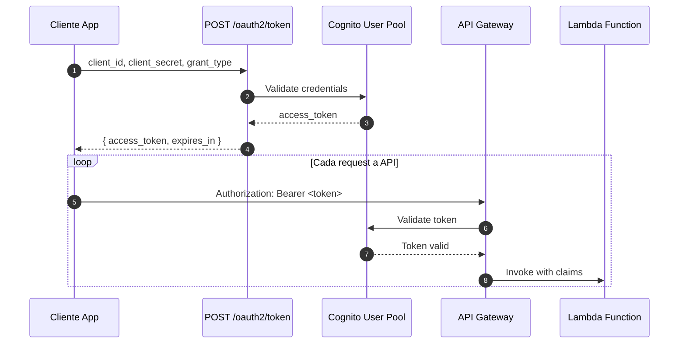
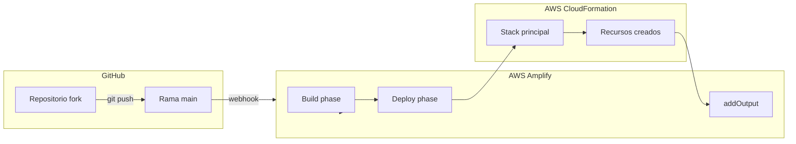

# Arquitectura de biometric-api

## Diagrama general del sistema

```mermaid
flowchart TD
    subgraph Cliente_Empresa["Cliente Empresa"]
        API["API REST"]
        Frontend["Frontend Portal"]
        DB["Base de datos propia"]
    end

    subgraph API_Gateway_Cognito["API Gateway + Cognito"]
        Gateway["API Gateway"]
        Cognito["Cognito User Pool"]
        TokenEndpoint["POST /oauth2/token"]
    end

    subgraph Admin_Lambdas["Lambdas Admin"]
        FnCreateClient["fn-admin-create-client"]
        FnCreateChannel["fn-admin-create-channel"]
        FnGetChannel["fn-admin-get-channel"]
        FnUpdateChannel["fn-admin-update-channel"]
    end

    subgraph Biometric_Lambdas["Lambdas Biometric"]
        FnStartCircuit["fn-start-circuit"]
        FnGetConfig["fn-get-config"]
        FnUploadUrl["fn-upload-url"]
        FnProcessCircuit["fn-process-circuit"]
    end

    subgraph AWS_Services["AWS Services"]
        subgraph DynamoDB["DynamoDB"]
            ChannelsTable["channels table"]
            CircuitsTable["circuits table"]
        end

        subgraph S3["S3"]
            DocumentsBucket["documents bucket\nbiometric-api-{env}-documents"]
        end

        subgraph Rekognition["Rekognition"]
            Liveness["GetFaceLivenessSessionResults"]
            CompareFaces["CompareFaces"]
        end

        subgraph Bedrock["Bedrock"]
            ClaudeOCR["Claude Sonnet 4.5\nOCR"]
            ClaudeVerify["Claude Sonnet 4.5\nData Verification"]
        end
    end

    subgraph End_User["End User"]
        Browser["Navegador/WebView"]
        Camera["Cámara"]
    end

    %% Cliente Empresa → Admin API
    API -->|"POST /admin/clients/create"| Gateway
    API -->|"POST /admin/channels"| Gateway
    API -->|"GET /admin/channels/{id}"| Gateway
    API -->|"PUT /admin/channels/{id}"| Gateway

    Gateway -->|"x-admin-key"| Cognito
    Gateway --> FnCreateClient
    Gateway --> FnCreateChannel
    Gateway --> FnGetChannel
    Gateway --> FnUpdateChannel

    FnCreateClient -->|"CreateUserPoolClient"| Cognito
    FnCreateChannel -->|"PutItem"| ChannelsTable
    FnGetChannel -->|"GetItem"| ChannelsTable
    FnUpdateChannel -->|"UpdateItem"| ChannelsTable

    %% Cliente Empresa → Biometric API
    API -->|"POST /oauth2/token"| TokenEndpoint
    TokenEndpoint --> Cognito
    API -->|"POST /start_circuit/{channel_id}"| Gateway
    API -->|"GET /get_config/{circuit_id}"| Gateway
    API -->|"GET /upload-url/{circuit_id}"| Gateway
    API -->|"POST /process_circuit/{circuit_id}"| Gateway

    Gateway --> FnStartCircuit
    Gateway --> FnGetConfig
    Gateway --> FnUploadUrl
    Gateway --> FnProcessCircuit

    FnStartCircuit -->|"GetItem"| ChannelsTable
    FnStartCircuit -->|"PutItem"| CircuitsTable
    FnGetConfig -->|"GetItem"| CircuitsTable
    FnGetConfig -->|"GetItem"| ChannelsTable
    FnUploadUrl -->|"GetItem"| CircuitsTable
    FnUploadUrl -->|"GetItem"| ChannelsTable
    FnProcessCircuit -->|"GetItem"| CircuitsTable
    FnProcessCircuit -->|"GetItem"| ChannelsTable
    FnProcessCircuit -->|"UpdateItem"| CircuitsTable

    %% Proceso de verificación
    End_User -->|"1. Abre link"| Frontend
    Frontend -->|"GET /get_config/{circuit_id}"| FnGetConfig
    FnGetConfig -->|"Devuelve config"| Frontend

    Frontend -->|"GET /upload-url?type=front"| FnUploadUrl
    FnUploadUrl -->|"Devuelve presigned URL"| Frontend
    Frontend -->|"PUT imagen"| DocumentsBucket
    Frontend -->|"Captura selfie"| Camera

    Frontend -->|"POST /process_circuit {liveness}"| FnProcessCircuit
    FnProcessCircuit -->|"GetFaceLivenessSessionResults"| Liveness
    Liveness -->|"confidence"| FnProcessCircuit
    FnProcessCircuit -->|"PutObject liveness-reference.jpg"| DocumentsBucket

    Frontend -->|"POST /process_circuit {ocr}"| FnProcessCircuit
    FnProcessCircuit -->|"GetObject front.jpg"| DocumentsBucket
    FnProcessCircuit -->|"InvokeModel"| ClaudeOCR
    ClaudeOCR -->|"extractedData"| FnProcessCircuit
    FnProcessCircuit -->|"PutObject front.jpg"| DocumentsBucket

    Frontend -->|"POST /process_circuit {data-verification}"| FnProcessCircuit
    FnProcessCircuit -->|"Compare OCR vs person"| ClaudeVerify
    ClaudeVerify -->|"matches"| FnProcessCircuit

    Frontend -->|"POST /process_circuit {compare-faces}"| FnProcessCircuit
    FnProcessCircuit -->|"GetObject liveness-reference.jpg"| DocumentsBucket
    FnProcessCircuit -->|"GetObject front.jpg"| DocumentsBucket
    FnProcessCircuit -->|"CompareFaces"| CompareFaces
    CompareFaces -->|"similarity"| FnProcessCircuit

    %% Completación
    FnProcessCircuit -->|"Update circuit + webhook"| CircuitsTable
    CircuitsTable -->|"POST webhookUrl"| API
```



## Flujo de autenticación



## Flujo de verificación biométrica

```mermaid
flowchart LR
    subgraph Circuit["Circuito de verificación"]
        A[liveness] --> B[ocr] --> C[data-verification] --> D[compare-faces]
    end

    subgraph Documentos["Documentos en S3"]
        D1[liveness-reference.jpg]
        D2[front.jpg]
        D3[back.jpg (opcional)]
    end

    subgraph Resultados["Resultados"]
        R1[liveness: confidence]
        R2[ocr: extractedData]
        R3[verify: matches]
        R4[compare: similarity]
    end

    A -->|"confidence >= threshold"| R1
    R1 -->|"descarga imagen"| D1
    B -->|"lee front.jpg"| D2
    B -->|"Claude OCR"| R2
    C -->|"compara OCR vs person"| R3
    D -->|"compara faces"| R4
```

## Estructura de datos en DynamoDB

### Tabla channels

```json
{
  "channel_id": "uuid",
  "code_client": "cliente001",
  "id_client": 123,
  "username": "admin@cliente.com",
  "name": "Verificación de identidad",
  "channel_type": "biometric",
  "created_at": "2025-08-20T10:00:00.000Z",
  "settings": {
    "steps": ["liveness", "ocr", "data-verification", "compare-faces"],
    "baseUrl": "https://verificacion.cliente.com",
    "webhookUrl": "https://api.cliente.com/callback",
    "projectId": "201208",
    "ui": { ... },
    "thresholds": { ... }
  }
}
```

### Tabla circuits

```json
{
  "circuit_id": "uuid",
  "channel_id": "uuid-del-canal",
  "channel_type": "biometric",
  "status": "completed",
  "current_step": null,
  "steps_completed": ["liveness", "ocr", "data-verification", "compare-faces"],
  "person": {
    "name": "Juan Pérez",
    "documentNumber": "12345678",
    "email": "juan@email.com"
  },
  "result": {
    "liveness": { "success": true, "confidence": 95 },
    "ocr": { "success": true, "extractedData": {...} },
    "data-verification": { "success": true, "matches": {...} },
    "compare-faces": { "success": true, "similarity": 92 }
  },
  "created_at": "2025-08-20T10:00:00.000Z",
  "expires_at": "2025-08-20T10:15:00.000Z",
  "completed_at": "2025-08-20T10:12:00.000Z",
  "geolocation": "Calle xxx, País"
}
```

## Estructura de S3

```
biometric-api-{env}-documents/
└── {code_client}/
    └── {circuit_id}/
        ├── liveness-reference.jpg  ← Selfie de liveness
        ├── front.jpg               ← Frente del documento
        └── back.jpg               ← Reverso del documento (opcional)
```

## Componentes de AWS

| Componente | Propósito | Configuración |
|------------|-----------|---------------|
| Cognito User Pool | Autenticación M2M con Client Credentials | Single scope: `biometric-danaconnect/access` |
| API Gateway | Endpoints REST | Regional, throttling 100 req/s |
| DynamoDB channels | Configuración de canales | PAY_PER_REQUEST |
| DynamoDB circuits | Instancias de verificación | PAY_PER_REQUEST con GSI |
| S3 documents | Documentos e imágenes | CORS habilitado, RemovalPolicy.DESTROY |
| Rekognition Liveness | Detección de vida | GetFaceLivenessSessionResults |
| Rekognition CompareFaces | Comparación de rostros | Similarity threshold configurable |
| Bedrock Claude Sonnet | OCR y verificación | modelo: anthropic.claude-sonnet-4-5-20250929-v1:0 |

## Consideraciones de seguridad

- **Circuitos expirados**: 15 minutos desde creación
- **Circuitos de uso único**: Status final (completed/failed) no permite más operaciones
- **Scopes de Cognito**: Un solo scope `access` para simplificar tokens
- **Webhook signing**: Opcional mediante HMAC
- **CORS**: Configurado para permitir origen del frontend
- **Throttling**: 100 req/s por método con burst de 200

## Tags estándar

Todos los recursos incluyen:

```yaml
Project: biometric-api
Environment: dev | staging | prod
Owner: danaconnect
```

## Deployment con Amplify



## Variables de entorno críticas

| Variable | Descripción | Sensitive |
|----------|-------------|-----------|
| `ADMIN_KEY` | Clave para API admin | Sí |
| `USER_POOL_ID` | ID del User Pool | No |
| `AWS_BRANCH` | Rama de ambiente | No |
## Seguridad por capas

| Endpoint | Auth | Quién lo llama |
|----------|------|----------------|
| POST /oauth2/token | Público | Backend del cliente |
| POST /api/biometric/start_circuit | Bearer token Cognito | Backend del cliente |
| GET /api/biometric/get_config | x-internal-key | Frontend portal |
| GET /api/biometric/upload-url | x-internal-key | Frontend portal |
| POST /api/biometric/process_circuit | x-internal-key | Frontend portal |
| POST /api/admin/* | x-admin-key | Soporte (Postman) |

**Notas sobre autenticación:**

- Los endpoints del frontend (`get_config`, `upload-url`, `process_circuit`) usan `x-internal-key` header porque son llamados directamente desde el navegador del usuario final, quien no tiene acceso a tokens de Cognito.
- El endpoint `start_circuit` usa Bearer token porque es llamado desde el backend del cliente (que sí tiene credenciales de Cognito).
- Los endpoints admin usan `x-admin-key` para operaciones de soporte via Postman.